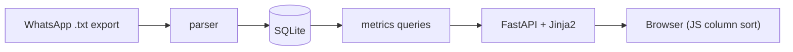

# Map Tappers League

Parses the exported "Map Tappers" WhatsApp chat into SQLite and serves a sortable
league table (maptap weighted score, sum-of-efforts, number of 100s) plus
per-player and per-day views.

## Data flow



## Setup

```bash
uv sync
```

## Import scores

```bash
uv run python -m maptap.importer "WhatsApp Chat with Map Tappers.txt"
```

Re-run any time with a fresh export; existing days update, new days are added.

## Run the dashboard

```bash
uv run uvicorn maptap.app:app --reload
```

Open http://localhost:8000/.

## Tests

```bash
uv run pytest
```
