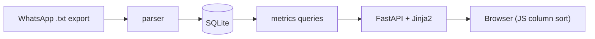
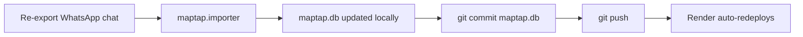

# Map Tappers League

Parses the exported "Map Tappers" WhatsApp chat into SQLite and serves a sortable
league table (maptap weighted score, sum-of-efforts, number of 100s) plus
per-player and per-day views.

## Data flow



## Setup

```bash
uv sync
```

## Import scores

```bash
uv run python -m maptap.importer "WhatsApp Chat with Map Tappers.txt"
```

Re-run any time with a fresh export; existing days update, new days are added.

## Run the dashboard

```bash
uv run uvicorn maptap.app:app --reload
```

Open http://localhost:8000/.

## Tests

```bash
uv run pytest
```

## Deployment (Render, free tier)

The app deploys as a Docker web service on Render's free tier. The committed
`maptap.db` snapshot is the source of truth that ships with the image (read-only
in production), so the dashboard works without any runtime database setup.

Deploy config lives in `Dockerfile` and `render.yaml`. The container binds to
Render's injected `$PORT` and reads `MAPTAP_DB=/app/maptap.db`.

### One-time setup

1. Push this repo to a Git remote (GitLab or GitHub).
2. In the Render dashboard: **New → Blueprint**, point it at the repo. Render
   reads `render.yaml` and provisions the free web service.
3. The first deploy builds the image and serves the snapshot at the Render URL.

### Updating the scores (publishing a new day)



Because `maptap.db` accumulates history (WhatsApp messages expire after 7 days),
keep the local `maptap.db` as the durable record — import into it and commit it;
don't delete it.

### Notes

- Free instances sleep after ~15 min idle; the first request after a lull takes
  ~30–50s to wake.
- The dashboard is public (no authentication).

## Run with Docker (local)

```bash
docker build -t maptap .
docker run --rm -p 8000:8000 maptap   # http://localhost:8000/
```
