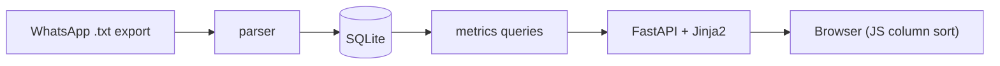

# Map Tappers League Implementation Plan

> **For agentic workers:** REQUIRED SUB-SKILL: Use superpowers:subagent-driven-development (recommended) or superpowers:executing-plans to implement this plan task-by-task. Steps use checkbox (`- [ ]`) syntax for tracking.

**Goal:** A local FastAPI web dashboard that parses the exported "Map Tappers" WhatsApp chat into SQLite and surfaces sortable league tables (maptap weighted score, sum-of-efforts, number of 100s) plus per-player and per-day views.

**Architecture:** A pure parser turns the export text into immutable `Entry` records; an idempotent SQLite layer stores entries and their individual rounds normalized; pure query functions derive every ranking; FastAPI + Jinja2 render three views and a ~30-line vanilla-JS sorter handles instant client-side column sorting.

**Tech Stack:** Python 3.12+, FastAPI, Jinja2, Uvicorn, stdlib `sqlite3`, pytest. Dependency management with `uv`.

## Global Constraints

- Python 3.12+; functional idioms preferred, immutable dataclasses for records.
- No wildcard imports.
- Parameterized tests where natural (`pytest.mark.parametrize`).
- No comments that merely restate the code.
- Raw rounds are stored individually; all rankings are derived by query, never stored.
- `maptap_score` (maptap "Final score") is distinct from `cumulative` (sum of the five round scores).
- Importer is idempotent, keyed on `(player, game_date)`.
- Source export lives at repo root: `WhatsApp Chat with Map Tappers.txt` (extracted from the `.zip`).
- Package name: `maptap` under `src/maptap/`.

---

## File Structure

```
maptap/
├── pyproject.toml              # uv project, deps, pytest config
├── src/maptap/
│   ├── __init__.py
│   ├── models.py               # Entry, Round dataclasses
│   ├── parser.py               # entries_from_text(text) -> list[Entry]
│   ├── db.py                   # connect/init schema + upsert_entries
│   ├── importer.py             # CLI: file -> parser -> db
│   ├── metrics.py              # all_entries / player_summary / daily_leaderboard
│   ├── app.py                  # FastAPI app + routes
│   ├── templates/
│   │   ├── base.html
│   │   ├── index.html          # sortable all-entries table
│   │   ├── players.html
│   │   └── days.html
│   └── static/
│       └── sort.js             # vanilla-JS column sorter + scoring-mode toggle
└── tests/
    ├── conftest.py             # fixtures: sample export text, in-memory db
    ├── test_parser.py
    ├── test_db.py
    ├── test_importer.py
    └── test_metrics.py
```

---

### Task 1: Project scaffold and models

**Files:**
- Create: `pyproject.toml`
- Create: `src/maptap/__init__.py`
- Create: `src/maptap/models.py`
- Test: `tests/test_models.py`

**Interfaces:**
- Consumes: nothing.
- Produces:
  - `Round` — frozen dataclass: `score: int`, `emoji: str`.
  - `Entry` — frozen dataclass: `player: str`, `game_date: datetime.date`, `maptap_score: int`, `rounds: tuple[Round, ...]`.
  - `Entry.cumulative -> int` (property): `sum(r.score for r in rounds)`.
  - `Entry.hundreds -> int` (property): `sum(1 for r in rounds if r.score == 100)`.

- [ ] **Step 1: Create `pyproject.toml`**

```toml
[project]
name = "maptap"
version = "0.1.0"
requires-python = ">=3.12"
dependencies = [
    "fastapi>=0.110",
    "uvicorn>=0.29",
    "jinja2>=3.1",
]

[dependency-groups]
dev = ["pytest>=8.0", "httpx>=0.27"]

[build-system]
requires = ["hatchling"]
build-backend = "hatchling.build"

[tool.hatch.build.targets.wheel]
packages = ["src/maptap"]

[tool.pytest.ini_options]
pythonpath = ["src"]
testpaths = ["tests"]
```

- [ ] **Step 2: Create `src/maptap/__init__.py`** (empty file)

- [ ] **Step 3: Write the failing test** in `tests/test_models.py`

```python
import datetime

import pytest

from maptap.models import Entry, Round


def _entry(scores):
    return Entry(
        player="Tester",
        game_date=datetime.date(2026, 6, 15),
        maptap_score=900,
        rounds=tuple(Round(score=s, emoji="🎯") for s in scores),
    )


@pytest.mark.parametrize(
    "scores, expected_cumulative, expected_hundreds",
    [
        ([100, 99, 98, 95, 86], 478, 1),
        ([100, 100, 100, 100, 85], 485, 4),
        ([4, 100, 90, 94, 89], 377, 1),
    ],
)
def test_entry_derived_metrics(scores, expected_cumulative, expected_hundreds):
    entry = _entry(scores)
    assert entry.cumulative == expected_cumulative
    assert entry.hundreds == expected_hundreds


def test_entry_is_frozen():
    entry = _entry([100, 100, 100, 100, 100])
    with pytest.raises(Exception):
        entry.player = "Changed"
```

- [ ] **Step 4: Run test to verify it fails**

Run: `uv run pytest tests/test_models.py -v`
Expected: FAIL with `ModuleNotFoundError: No module named 'maptap.models'`

- [ ] **Step 5: Implement `src/maptap/models.py`**

```python
from dataclasses import dataclass


@dataclass(frozen=True, slots=True)
class Round:
    score: int
    emoji: str


@dataclass(frozen=True, slots=True)
class Entry:
    player: str
    game_date: "datetime.date"
    maptap_score: int
    rounds: tuple[Round, ...]

    @property
    def cumulative(self) -> int:
        return sum(r.score for r in self.rounds)

    @property
    def hundreds(self) -> int:
        return sum(1 for r in self.rounds if r.score == 100)


import datetime  # noqa: E402  (referenced as string annotation above)
```

Note: replace the trailing import by putting `import datetime` at the top and annotating `game_date: datetime.date` directly — cleaner:

```python
import datetime
from dataclasses import dataclass


@dataclass(frozen=True, slots=True)
class Round:
    score: int
    emoji: str


@dataclass(frozen=True, slots=True)
class Entry:
    player: str
    game_date: datetime.date
    maptap_score: int
    rounds: tuple[Round, ...]

    @property
    def cumulative(self) -> int:
        return sum(r.score for r in self.rounds)

    @property
    def hundreds(self) -> int:
        return sum(1 for r in self.rounds if r.score == 100)
```

- [ ] **Step 6: Run test to verify it passes**

Run: `uv run pytest tests/test_models.py -v`
Expected: PASS (4 tests)

- [ ] **Step 7: Commit**

```bash
git add pyproject.toml src/maptap/__init__.py src/maptap/models.py tests/test_models.py
git commit -m "feat: project scaffold and Entry/Round models"
```

---

### Task 2: Parser

**Files:**
- Create: `src/maptap/parser.py`
- Create: `tests/conftest.py`
- Test: `tests/test_parser.py`

**Interfaces:**
- Consumes: `Entry`, `Round` from `maptap.models`.
- Produces:
  - `entries_from_text(text: str) -> list[Entry]` — parses a full WhatsApp export. Ignores non-scoring messages; logs a `logging.warning` for any line containing `maptap.gg` it cannot fully parse.

- [ ] **Step 1: Create `tests/conftest.py` with a sample export fixture**

```python
import pytest

SAMPLE_EXPORT = """\
04/06/2026, 20:21 - Steve Risdon created group "Map Tappers"
15/06/2026, 07:37 - Daniel Chicot: www.maptap.gg June 15
100🎯 99🎯 98🎯 95🏅 86🌟
Final score: 938
15/06/2026, 08:15 - Finn Risdon: www.maptap.gg June 15
100🎯 100🎯 100🎯 100🎯 85🌟
Final score: 955
17/06/2026, 19:55 - Finn Risdon: <Media omitted>
19/06/2026, 08:59 - Steve Risdon: Worst one ever 😢


www.maptap.gg June 19
82👏 96🔥 99🎯 77👏 59🫣
Final score: 784
20/06/2026, 09:10 - Finn Risdon: www.maptap.gg June 20
4🤮 100🎯 90👑 94🏅 89👑
Final score: 833 

Absolutely fucked it with the first one...
"""


@pytest.fixture
def sample_export() -> str:
    return SAMPLE_EXPORT
```

- [ ] **Step 2: Write the failing test** in `tests/test_parser.py`

```python
import datetime

from maptap.parser import entries_from_text


def test_parses_all_scoring_messages(sample_export):
    entries = entries_from_text(sample_export)
    assert len(entries) == 4


def test_parses_fields_correctly(sample_export):
    entries = entries_from_text(sample_export)
    dan = next(e for e in entries if e.player == "Daniel Chicot")
    assert dan.game_date == datetime.date(2026, 6, 15)
    assert dan.maptap_score == 938
    assert [r.score for r in dan.rounds] == [100, 99, 98, 95, 86]
    assert dan.rounds[0].emoji == "🎯"
    assert dan.cumulative == 478
    assert dan.hundreds == 1


def test_handles_chatter_before_scoreblock(sample_export):
    entries = entries_from_text(sample_export)
    steve = next(e for e in entries if e.player == "Steve Risdon")
    assert steve.game_date == datetime.date(2026, 6, 19)
    assert steve.maptap_score == 784
    assert steve.rounds[4].score == 59


def test_handles_trailing_text_after_final_score(sample_export):
    entries = entries_from_text(sample_export)
    finn_20 = next(
        e for e in entries
        if e.player == "Finn Risdon" and e.game_date == datetime.date(2026, 6, 20)
    )
    assert finn_20.maptap_score == 833
    assert finn_20.rounds[0].score == 4
```

- [ ] **Step 3: Run test to verify it fails**

Run: `uv run pytest tests/test_parser.py -v`
Expected: FAIL with `ModuleNotFoundError: No module named 'maptap.parser'`

- [ ] **Step 4: Implement `src/maptap/parser.py`**

```python
import datetime
import logging
import re

from maptap.models import Entry, Round

logger = logging.getLogger(__name__)

_MESSAGE = re.compile(
    r"^(?P<day>\d{2})/(?P<month>\d{2})/(?P<year>\d{4}), "
    r"\d{2}:\d{2} - (?P<sender>[^:]+): (?P<body>.*)$"
)
_HEADER = re.compile(r"maptap\.gg", re.IGNORECASE)
_ROUND = re.compile(r"(\d{1,3})(\D+)")
_FINAL = re.compile(r"Final score:\s*(\d+)")


def _messages(text):
    current = None
    for line in text.splitlines():
        match = _MESSAGE.match(line)
        if match:
            if current is not None:
                yield current
            current = (match, [match.group("body")])
        elif current is not None:
            current[1].append(line)
    if current is not None:
        yield current


def _parse_rounds(blob):
    rounds = []
    for score_text, emoji in _ROUND.findall(blob):
        rounds.append(Round(score=int(score_text), emoji=emoji.strip()))
    return tuple(rounds)


def _entry_from_message(match, lines):
    sender = match.group("sender").strip()
    msg_year = int(match.group("year"))
    body = "\n".join(lines)

    final = _FINAL.search(body)
    if final is None:
        logger.warning("maptap message without Final score from %s", sender)
        return None

    before_final = body[: final.start()]
    score_blob = before_final.split("maptap.gg", 1)[1]
    score_blob = re.sub(r"^[^\n]*\n", "", score_blob, count=1)
    rounds = _parse_rounds(score_blob)
    if len(rounds) != 5:
        logger.warning(
            "maptap message from %s had %d rounds (expected 5)", sender, len(rounds)
        )
        return None

    header_line = before_final.splitlines()[0]
    date_match = re.search(r"maptap\.gg\s+([A-Za-z]+)\s+(\d{1,2})", header_line)
    game_date = _game_date(date_match, msg_year, match)

    return Entry(
        player=sender,
        game_date=game_date,
        maptap_score=int(final.group(1)),
        rounds=rounds,
    )


def _game_date(date_match, msg_year, msg_match):
    if date_match is None:
        return datetime.date(
            msg_year, int(msg_match.group("month")), int(msg_match.group("day"))
        )
    month = datetime.datetime.strptime(date_match.group(1), "%B").month
    return datetime.date(msg_year, month, int(date_match.group(2)))


def entries_from_text(text: str) -> list[Entry]:
    entries = []
    for match, lines in _messages(text):
        body = "\n".join(lines)
        if not _HEADER.search(body):
            continue
        entry = _entry_from_message(match, lines)
        if entry is not None:
            entries.append(entry)
    return entries
```

- [ ] **Step 5: Run test to verify it passes**

Run: `uv run pytest tests/test_parser.py -v`
Expected: PASS (4 tests)

- [ ] **Step 6: Verify against the real export**

Run: `uv run python -c "from maptap.parser import entries_from_text; import pathlib; print(len(entries_from_text(pathlib.Path('WhatsApp Chat with Map Tappers.txt').read_text())))"`
Expected: prints `22`

- [ ] **Step 7: Commit**

```bash
git add src/maptap/parser.py tests/conftest.py tests/test_parser.py
git commit -m "feat: parse WhatsApp export into Entry records"
```

---

### Task 3: SQLite layer

**Files:**
- Create: `src/maptap/db.py`
- Test: `tests/test_db.py`

**Interfaces:**
- Consumes: `Entry` from `maptap.models`.
- Produces:
  - `connect(path: str = ":memory:") -> sqlite3.Connection` — returns a connection with schema initialized and `row_factory = sqlite3.Row`.
  - `upsert_entries(conn: sqlite3.Connection, entries: Iterable[Entry]) -> None` — idempotent on `(player, game_date)`; replaces that entry's rounds.

- [ ] **Step 1: Write the failing test** in `tests/test_db.py`

```python
import datetime

from maptap.db import connect, upsert_entries
from maptap.models import Entry, Round


def _entry(player, score, maptap, scores):
    return Entry(
        player=player,
        game_date=datetime.date(2026, 6, 15),
        maptap_score=maptap,
        rounds=tuple(Round(score=s, emoji="🎯") for s in scores),
    )


def test_upsert_inserts_entry_and_rounds():
    conn = connect()
    upsert_entries(conn, [_entry("Dan", 1, 938, [100, 99, 98, 95, 86])])
    entries = conn.execute("SELECT player, maptap_score FROM entries").fetchall()
    rounds = conn.execute("SELECT score FROM rounds ORDER BY idx").fetchall()
    assert [dict(r) for r in entries] == [{"player": "Dan", "maptap_score": 938}]
    assert [r["score"] for r in rounds] == [100, 99, 98, 95, 86]


def test_upsert_is_idempotent_on_player_and_date():
    conn = connect()
    entry = _entry("Dan", 1, 938, [100, 99, 98, 95, 86])
    upsert_entries(conn, [entry])
    upsert_entries(conn, [entry])
    count = conn.execute("SELECT COUNT(*) AS n FROM entries").fetchone()["n"]
    rounds = conn.execute("SELECT COUNT(*) AS n FROM rounds").fetchone()["n"]
    assert count == 1
    assert rounds == 5


def test_upsert_updates_existing_day():
    conn = connect()
    upsert_entries(conn, [_entry("Dan", 1, 938, [100, 99, 98, 95, 86])])
    upsert_entries(conn, [_entry("Dan", 1, 999, [100, 100, 100, 100, 100])])
    row = conn.execute("SELECT maptap_score FROM entries").fetchone()
    rounds = conn.execute("SELECT score FROM rounds ORDER BY idx").fetchall()
    assert row["maptap_score"] == 999
    assert [r["score"] for r in rounds] == [100, 100, 100, 100, 100]
```

- [ ] **Step 2: Run test to verify it fails**

Run: `uv run pytest tests/test_db.py -v`
Expected: FAIL with `ModuleNotFoundError: No module named 'maptap.db'`

- [ ] **Step 3: Implement `src/maptap/db.py`**

```python
import sqlite3
from collections.abc import Iterable

from maptap.models import Entry

_SCHEMA = """
CREATE TABLE IF NOT EXISTS entries (
    id INTEGER PRIMARY KEY,
    player TEXT NOT NULL,
    game_date TEXT NOT NULL,
    maptap_score INTEGER NOT NULL,
    UNIQUE (player, game_date)
);
CREATE TABLE IF NOT EXISTS rounds (
    entry_id INTEGER NOT NULL REFERENCES entries(id) ON DELETE CASCADE,
    idx INTEGER NOT NULL,
    score INTEGER NOT NULL,
    emoji TEXT NOT NULL,
    PRIMARY KEY (entry_id, idx)
);
"""


def connect(path: str = ":memory:") -> sqlite3.Connection:
    conn = sqlite3.connect(path)
    conn.row_factory = sqlite3.Row
    conn.execute("PRAGMA foreign_keys = ON")
    conn.executescript(_SCHEMA)
    return conn


def upsert_entries(conn: sqlite3.Connection, entries: Iterable[Entry]) -> None:
    for entry in entries:
        cur = conn.execute(
            """
            INSERT INTO entries (player, game_date, maptap_score)
            VALUES (?, ?, ?)
            ON CONFLICT (player, game_date)
            DO UPDATE SET maptap_score = excluded.maptap_score
            RETURNING id
            """,
            (entry.player, entry.game_date.isoformat(), entry.maptap_score),
        )
        entry_id = cur.fetchone()["id"]
        conn.execute("DELETE FROM rounds WHERE entry_id = ?", (entry_id,))
        conn.executemany(
            "INSERT INTO rounds (entry_id, idx, score, emoji) VALUES (?, ?, ?, ?)",
            [
                (entry_id, i, r.score, r.emoji)
                for i, r in enumerate(entry.rounds)
            ],
        )
    conn.commit()
```

- [ ] **Step 4: Run test to verify it passes**

Run: `uv run pytest tests/test_db.py -v`
Expected: PASS (3 tests)

- [ ] **Step 5: Commit**

```bash
git add src/maptap/db.py tests/test_db.py
git commit -m "feat: idempotent SQLite storage for entries and rounds"
```

---

### Task 4: Importer

**Files:**
- Create: `src/maptap/importer.py`
- Test: `tests/test_importer.py`

**Interfaces:**
- Consumes: `entries_from_text` (parser), `connect`, `upsert_entries` (db).
- Produces:
  - `import_file(path: str, db_path: str) -> int` — reads the export at `path`, parses, upserts into the SQLite db at `db_path`, returns the number of entries imported.
  - `main(argv: list[str] | None = None) -> None` — CLI entry: `python -m maptap.importer <export.txt> [--db maptap.db]`.

- [ ] **Step 1: Write the failing test** in `tests/test_importer.py`

```python
from maptap.db import connect
from maptap.importer import import_file
from tests.conftest import SAMPLE_EXPORT


def test_import_file_is_idempotent(tmp_path):
    export = tmp_path / "chat.txt"
    export.write_text(SAMPLE_EXPORT, encoding="utf-8")
    db = tmp_path / "maptap.db"

    first = import_file(str(export), str(db))
    second = import_file(str(export), str(db))

    assert first == 4
    assert second == 4

    conn = connect(str(db))
    count = conn.execute("SELECT COUNT(*) AS n FROM entries").fetchone()["n"]
    assert count == 4
```

- [ ] **Step 2: Run test to verify it fails**

Run: `uv run pytest tests/test_importer.py -v`
Expected: FAIL with `ModuleNotFoundError: No module named 'maptap.importer'`

- [ ] **Step 3: Implement `src/maptap/importer.py`**

```python
import argparse
import pathlib

from maptap.db import connect, upsert_entries
from maptap.parser import entries_from_text


def import_file(path: str, db_path: str) -> int:
    text = pathlib.Path(path).read_text(encoding="utf-8")
    entries = entries_from_text(text)
    conn = connect(db_path)
    upsert_entries(conn, entries)
    conn.close()
    return len(entries)


def main(argv: list[str] | None = None) -> None:
    parser = argparse.ArgumentParser(description="Import a Map Tappers WhatsApp export")
    parser.add_argument("export", help="path to the exported chat .txt")
    parser.add_argument("--db", default="maptap.db", help="SQLite database path")
    args = parser.parse_args(argv)
    count = import_file(args.export, args.db)
    print(f"Imported {count} entries into {args.db}")


if __name__ == "__main__":
    main()
```

- [ ] **Step 4: Run test to verify it passes**

Run: `uv run pytest tests/test_importer.py -v`
Expected: PASS (1 test)

- [ ] **Step 5: Import the real export**

Run: `uv run python -m maptap.importer "WhatsApp Chat with Map Tappers.txt"`
Expected: prints `Imported 22 entries into maptap.db`

- [ ] **Step 6: Commit**

```bash
git add src/maptap/importer.py tests/test_importer.py
git commit -m "feat: re-runnable importer CLI"
```

---

### Task 5: Metrics queries

**Files:**
- Create: `src/maptap/metrics.py`
- Test: `tests/test_metrics.py`

**Interfaces:**
- Consumes: a `sqlite3.Connection` (from `db.connect`), `upsert_entries`, `entries_from_text`.
- Produces:
  - `all_entries(conn) -> list[dict]` — one dict per entry: keys `player`, `game_date` (str), `maptap_score`, `cumulative`, `hundreds`, `rounds` (list[int]). Default order: `maptap_score` desc.
  - `player_summary(conn) -> list[dict]` — keys `player`, `best` (max maptap), `total_maptap`, `total_cumulative`, `total_hundreds`, `days_played`, `wins`. `wins` = days where the player had the strict-or-tied highest maptap among players who posted that day.
  - `daily_leaderboard(conn) -> list[dict]` — keys `game_date`, `standings` (list of `{position, player, maptap_score}` ranked desc).

- [ ] **Step 1: Write the failing test** in `tests/test_metrics.py`

```python
from maptap.db import connect, upsert_entries
from maptap.metrics import all_entries, daily_leaderboard, player_summary
from maptap.parser import entries_from_text
from tests.conftest import SAMPLE_EXPORT


def _conn():
    conn = connect()
    upsert_entries(conn, entries_from_text(SAMPLE_EXPORT))
    return conn


def test_all_entries_default_sorted_by_maptap_desc():
    rows = all_entries(_conn())
    scores = [r["maptap_score"] for r in rows]
    assert scores == sorted(scores, reverse=True)
    assert scores[0] == 955


def test_all_entries_includes_derived_fields():
    rows = all_entries(_conn())
    dan = next(r for r in rows if r["player"] == "Daniel Chicot")
    assert dan["cumulative"] == 478
    assert dan["hundreds"] == 1
    assert dan["rounds"] == [100, 99, 98, 95, 86]


def test_player_summary_personal_best():
    summary = {r["player"]: r for r in player_summary(_conn())}
    assert summary["Finn Risdon"]["best"] == 955
    assert summary["Daniel Chicot"]["days_played"] == 1


def test_daily_leaderboard_ranks_per_day():
    days = {d["game_date"]: d for d in daily_leaderboard(_conn())}
    june15 = days["2026-06-15"]
    assert june15["standings"][0]["player"] == "Finn Risdon"
    assert june15["standings"][0]["position"] == 1
    assert june15["standings"][1]["player"] == "Daniel Chicot"
```

- [ ] **Step 2: Run test to verify it fails**

Run: `uv run pytest tests/test_metrics.py -v`
Expected: FAIL with `ModuleNotFoundError: No module named 'maptap.metrics'`

- [ ] **Step 3: Implement `src/maptap/metrics.py`**

```python
import sqlite3


def all_entries(conn: sqlite3.Connection) -> list[dict]:
    rows = conn.execute(
        """
        SELECT e.id, e.player, e.game_date, e.maptap_score,
               SUM(r.score) AS cumulative,
               SUM(CASE WHEN r.score = 100 THEN 1 ELSE 0 END) AS hundreds
        FROM entries e
        JOIN rounds r ON r.entry_id = e.id
        GROUP BY e.id
        ORDER BY e.maptap_score DESC
        """
    ).fetchall()
    result = []
    for row in rows:
        rounds = conn.execute(
            "SELECT score FROM rounds WHERE entry_id = ? ORDER BY idx", (row["id"],)
        ).fetchall()
        result.append(
            {
                "player": row["player"],
                "game_date": row["game_date"],
                "maptap_score": row["maptap_score"],
                "cumulative": row["cumulative"],
                "hundreds": row["hundreds"],
                "rounds": [r["score"] for r in rounds],
            }
        )
    return result


def player_summary(conn: sqlite3.Connection) -> list[dict]:
    base = conn.execute(
        """
        SELECT e.player,
               MAX(e.maptap_score) AS best,
               SUM(e.maptap_score) AS total_maptap,
               SUM(r_sum.cumulative) AS total_cumulative,
               SUM(r_sum.hundreds) AS total_hundreds,
               COUNT(*) AS days_played
        FROM entries e
        JOIN (
            SELECT entry_id,
                   SUM(score) AS cumulative,
                   SUM(CASE WHEN score = 100 THEN 1 ELSE 0 END) AS hundreds
            FROM rounds GROUP BY entry_id
        ) r_sum ON r_sum.entry_id = e.id
        GROUP BY e.player
        ORDER BY total_maptap DESC
        """
    ).fetchall()

    wins = _wins_by_player(conn)
    return [
        {
            "player": row["player"],
            "best": row["best"],
            "total_maptap": row["total_maptap"],
            "total_cumulative": row["total_cumulative"],
            "total_hundreds": row["total_hundreds"],
            "days_played": row["days_played"],
            "wins": wins.get(row["player"], 0),
        }
        for row in base
    ]


def _wins_by_player(conn: sqlite3.Connection) -> dict[str, int]:
    rows = conn.execute(
        """
        SELECT player FROM entries e
        WHERE e.maptap_score = (
            SELECT MAX(maptap_score) FROM entries e2
            WHERE e2.game_date = e.game_date
        )
        """
    ).fetchall()
    counts: dict[str, int] = {}
    for row in rows:
        counts[row["player"]] = counts.get(row["player"], 0) + 1
    return counts


def daily_leaderboard(conn: sqlite3.Connection) -> list[dict]:
    rows = conn.execute(
        """
        SELECT game_date, player, maptap_score
        FROM entries
        ORDER BY game_date DESC, maptap_score DESC
        """
    ).fetchall()
    by_day: dict[str, list[dict]] = {}
    for row in rows:
        standings = by_day.setdefault(row["game_date"], [])
        standings.append(
            {
                "position": len(standings) + 1,
                "player": row["player"],
                "maptap_score": row["maptap_score"],
            }
        )
    return [{"game_date": day, "standings": standings} for day, standings in by_day.items()]
```

- [ ] **Step 4: Run test to verify it passes**

Run: `uv run pytest tests/test_metrics.py -v`
Expected: PASS (4 tests)

- [ ] **Step 5: Add a regression test for known full-dataset facts** in `tests/test_metrics.py`

```python
import pathlib

from maptap.metrics import all_entries


def test_known_facts_from_full_export():
    conn = connect()
    text = pathlib.Path("WhatsApp Chat with Map Tappers.txt").read_text(encoding="utf-8")
    upsert_entries(conn, entries_from_text(text))
    rows = all_entries(conn)

    top = rows[0]
    assert top["player"] == "Daniel Chicot"
    assert top["maptap_score"] == 987

    four_hundred_entries = [r for r in rows if r["player"] == "Finn Risdon" and r["hundreds"] == 4]
    assert len(four_hundred_entries) == 2
```

- [ ] **Step 6: Run test to verify it passes**

Run: `uv run pytest tests/test_metrics.py -v`
Expected: PASS (5 tests)

- [ ] **Step 7: Commit**

```bash
git add src/maptap/metrics.py tests/test_metrics.py
git commit -m "feat: derived league-table metrics queries"
```

---

### Task 6: FastAPI app, templates, and JS sorter

**Files:**
- Create: `src/maptap/app.py`
- Create: `src/maptap/templates/base.html`
- Create: `src/maptap/templates/index.html`
- Create: `src/maptap/templates/players.html`
- Create: `src/maptap/templates/days.html`
- Create: `src/maptap/static/sort.js`
- Test: `tests/test_app.py`

**Interfaces:**
- Consumes: `connect` (db), `all_entries`, `player_summary`, `daily_leaderboard` (metrics).
- Produces: a FastAPI `app` with routes `GET /`, `GET /players`, `GET /days`. Reads `MAPTAP_DB` env var (default `maptap.db`).

- [ ] **Step 1: Write the failing test** in `tests/test_app.py`

```python
import pathlib

from fastapi.testclient import TestClient

from maptap.db import connect, upsert_entries
from maptap.parser import entries_from_text
from tests.conftest import SAMPLE_EXPORT


def _build_db(path):
    conn = connect(str(path))
    upsert_entries(conn, entries_from_text(SAMPLE_EXPORT))
    conn.close()


def test_index_lists_entries(tmp_path, monkeypatch):
    db = tmp_path / "maptap.db"
    _build_db(db)
    monkeypatch.setenv("MAPTAP_DB", str(db))

    from maptap.app import app

    client = TestClient(app)
    response = client.get("/")
    assert response.status_code == 200
    assert "Daniel Chicot" in response.text
    assert "955" in response.text


def test_players_and_days_routes(tmp_path, monkeypatch):
    db = tmp_path / "maptap.db"
    _build_db(db)
    monkeypatch.setenv("MAPTAP_DB", str(db))

    from maptap.app import app

    client = TestClient(app)
    assert client.get("/players").status_code == 200
    assert client.get("/days").status_code == 200
```

- [ ] **Step 2: Run test to verify it fails**

Run: `uv run pytest tests/test_app.py -v`
Expected: FAIL with `ModuleNotFoundError: No module named 'maptap.app'`

- [ ] **Step 3: Implement `src/maptap/app.py`**

```python
import os
import pathlib

from fastapi import FastAPI, Request
from fastapi.responses import HTMLResponse
from fastapi.staticfiles import StaticFiles
from fastapi.templating import Jinja2Templates

from maptap.db import connect
from maptap.metrics import all_entries, daily_leaderboard, player_summary

_BASE = pathlib.Path(__file__).parent
templates = Jinja2Templates(directory=str(_BASE / "templates"))

app = FastAPI(title="Map Tappers League")
app.mount("/static", StaticFiles(directory=str(_BASE / "static")), name="static")


def _conn():
    return connect(os.environ.get("MAPTAP_DB", "maptap.db"))


@app.get("/", response_class=HTMLResponse)
def index(request: Request):
    conn = _conn()
    rows = all_entries(conn)
    conn.close()
    return templates.TemplateResponse(
        request, "index.html", {"entries": rows}
    )


@app.get("/players", response_class=HTMLResponse)
def players(request: Request):
    conn = _conn()
    rows = player_summary(conn)
    conn.close()
    return templates.TemplateResponse(
        request, "players.html", {"players": rows}
    )


@app.get("/days", response_class=HTMLResponse)
def days(request: Request):
    conn = _conn()
    rows = daily_leaderboard(conn)
    conn.close()
    return templates.TemplateResponse(request, "days.html", {"days": rows})
```

- [ ] **Step 4: Implement `src/maptap/templates/base.html`**

```html
<!DOCTYPE html>
<html lang="en">
<head>
    <meta charset="utf-8">
    <meta name="viewport" content="width=device-width, initial-scale=1">
    <title>Map Tappers League</title>
    <style>
        body { font-family: system-ui, sans-serif; margin: 2rem; }
        nav a { margin-right: 1rem; }
        table { border-collapse: collapse; width: 100%; }
        th, td { padding: .4rem .6rem; border-bottom: 1px solid #ddd; text-align: right; }
        th:first-child, td:first-child, th:nth-child(2), td:nth-child(2) { text-align: left; }
        th[data-sort] { cursor: pointer; user-select: none; }
        th[data-sort]:hover { background: #f0f0f0; }
        caption { text-align: left; font-weight: bold; margin-bottom: .5rem; }
    </style>
</head>
<body>
    <nav>
        <a href="/">League</a>
        <a href="/players">Players</a>
        <a href="/days">By day</a>
    </nav>
    
    
</body>
</html>
```

- [ ] **Step 5: Implement `src/maptap/templates/index.html`**

```html


<h1>Map Tappers — All-time league</h1>
<p>Click a column header to sort.</p>
<table id="league">
    <thead>
        <tr>
            <th>Player</th>
            <th>Date</th>
            <th data-sort="number">MapTap</th>
            <th data-sort="number">Cumulative</th>
            <th data-sort="number">#100s</th>
            <th>Rounds</th>
        </tr>
    </thead>
    <tbody>
        
        <tr>
            <td>{{ e.player }}</td>
            <td>{{ e.game_date }}</td>
            <td>{{ e.maptap_score }}</td>
            <td>{{ e.cumulative }}</td>
            <td>{{ e.hundreds }}</td>
            <td>{{ e.rounds | join(" ") }}</td>
        </tr>
        
    </tbody>
</table>


<script src="/static/sort.js"></script>

```

- [ ] **Step 6: Implement `src/maptap/templates/players.html`**

```html


<h1>Player summary</h1>
<table>
    <thead>
        <tr>
            <th>Player</th><th>Best</th><th>Total MapTap</th>
            <th>Total Cumulative</th><th>Total #100s</th>
            <th>Days</th><th>Wins</th>
        </tr>
    </thead>
    <tbody>
        
        <tr>
            <td>{{ p.player }}</td>
            <td>{{ p.best }}</td>
            <td>{{ p.total_maptap }}</td>
            <td>{{ p.total_cumulative }}</td>
            <td>{{ p.total_hundreds }}</td>
            <td>{{ p.days_played }}</td>
            <td>{{ p.wins }}</td>
        </tr>
        
    </tbody>
</table>

```

- [ ] **Step 7: Implement `src/maptap/templates/days.html`**

```html


<h1>By day</h1>

<table>
    <caption>{{ day.game_date }}</caption>
    <thead><tr><th>Pos</th><th>Player</th><th>MapTap</th></tr></thead>
    <tbody>
        
        <tr><td>{{ s.position }}</td><td>{{ s.player }}</td><td>{{ s.maptap_score }}</td></tr>
        
    </tbody>
</table>


```

- [ ] **Step 8: Implement `src/maptap/static/sort.js`**

```javascript
(function () {
  const table = document.getElementById("league");
  if (!table) return;
  const tbody = table.tBodies[0];
  const headers = table.querySelectorAll("th[data-sort]");

  headers.forEach((th, headerIndex) => {
    const colIndex = Array.from(th.parentNode.children).indexOf(th);
    let descending = true;
    th.addEventListener("click", () => {
      const rows = Array.from(tbody.rows);
      rows.sort((a, b) => {
        const av = Number(a.cells[colIndex].textContent);
        const bv = Number(b.cells[colIndex].textContent);
        return descending ? bv - av : av - bv;
      });
      descending = !descending;
      rows.forEach((row) => tbody.appendChild(row));
    });
  });
})();
```

- [ ] **Step 9: Run tests to verify they pass**

Run: `uv run pytest tests/test_app.py -v`
Expected: PASS (2 tests)

- [ ] **Step 10: Manual smoke test**

Run: `uv run uvicorn maptap.app:app --port 8000` (after `python -m maptap.importer "WhatsApp Chat with Map Tappers.txt"`), then open `http://localhost:8000/`. Verify the table renders and column headers re-sort.

- [ ] **Step 11: Commit**

```bash
git add src/maptap/app.py src/maptap/templates src/maptap/static tests/test_app.py
git commit -m "feat: FastAPI dashboard with sortable league table and views"
```

---

### Task 7: README and full test run

**Files:**
- Create: `README.md`
- Create: `.gitignore`

**Interfaces:**
- Consumes: everything above.
- Produces: developer-facing docs and ignore rules.

- [ ] **Step 1: Create `.gitignore`**

```
__pycache__/
*.pyc
.venv/
maptap.db
_whatsapp_extract/
```

- [ ] **Step 2: Create `README.md`** with setup, import, and run instructions plus a mermaid data-flow diagram

```markdown
# Map Tappers League

Parses the exported "Map Tappers" WhatsApp chat into SQLite and serves a sortable
league table (maptap weighted score, sum-of-efforts, number of 100s) plus
per-player and per-day views.

## Data flow



## Setup

```bash
uv sync
```

## Import scores

```bash
uv run python -m maptap.importer "WhatsApp Chat with Map Tappers.txt"
```

Re-run any time with a fresh export; existing days update, new days are added.

## Run the dashboard

```bash
uv run uvicorn maptap.app:app --reload
```

Open http://localhost:8000/.

## Tests

```bash
uv run pytest
```
```

- [ ] **Step 3: Run the full test suite**

Run: `uv run pytest -v`
Expected: PASS (all tests across the suite)

- [ ] **Step 4: Commit**

```bash
git add README.md .gitignore
git commit -m "docs: README and gitignore"
```

---

## Self-Review

**Spec coverage:**
- Sortable all-entries table (maptap / cumulative / #100s) → Task 5 (`all_entries`) + Task 6 (index + sort.js). ✓
- Per-player summary → Task 5 (`player_summary`) + Task 6 (players.html). ✓
- Per-day leaderboard → Task 5 (`daily_leaderboard`) + Task 6 (days.html). ✓
- Raw rounds stored individually → Task 3 schema. ✓
- maptap vs cumulative distinction → Task 1 model + Task 5 queries. ✓
- Idempotent importer → Task 3 (`upsert_entries`) + Task 4 (`import_file`). ✓
- Parser skips chatter / warns on malformed → Task 2. ✓
- Year derived from message timestamp → Task 2 (`_game_date`). ✓
- Tests assert known facts (987 top, Finn two four-100 rounds) → Task 5 Step 5. ✓
- Scoring-mode toggle (weighted ↔ sum-of-efforts): the cumulative column is present and sortable, satisfying the comparison; a dedicated toggle button is deferred as non-essential (the user can sort by either column directly). Noted as a known simplification.

**Placeholder scan:** No TBD/TODO; every code step shows complete code. (Task 1 Step 5 intentionally shows the cleaner final version after the note — implementer uses the second block.)

**Type consistency:** `Entry`/`Round` field names consistent across tasks; `connect`/`upsert_entries`/`entries_from_text`/`all_entries`/`player_summary`/`daily_leaderboard` signatures match between producer and consumer blocks.

**Known simplification vs spec:** The spec mentioned a scoring-mode *toggle button*. The plan delivers the same capability through sortable `MapTap` and `Cumulative` columns rather than a mode switch, keeping the JS minimal (YAGNI). Flagged here for the reviewer; can be added later if desired.
