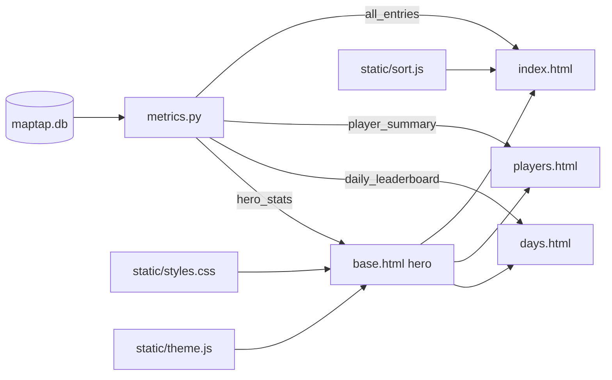

# MapTap League — Visual Redesign Design

Date: 2026-06-26

## Goal

Apply the look and feel of the Leeds 10K results site
(https://leeds10k.onrender.com/) to the MapTap League app, faithfully reusing
its dark/lime theme, typography, and signature components (hero, stat cards,
podium), while keeping the existing FastAPI server-rendered multi-page
architecture and all current data and behaviour.

This is a **presentation-layer change only**. The parser, database, importer,
and metric SQL are unchanged except for one additive metric function used by
the new hero.

## Scope

In scope:
- Full theme port: dark-first palette with lime `#c8f135` accent and a working
  dark/light toggle.
- Google Fonts: Anton (display), Hanken Grotesk (body), JetBrains Mono (numbers).
- Shared sticky nav + giant "MAP TAPPERS" hero + 4-card stat row on every page.
- League page (`/`): player-filter chips, results-meta count, restyled sortable
  table in a panel card.
- Players page (`/players`): gold/silver/bronze podium above a restyled summary
  table.
- Days page (`/days`): per-day standings panels with medal-coloured ranks.

Out of scope (YAGNI):
- No Chart.js, no charts. The reference's histograms/donuts do not fit 3 players.
- No single-page-app rebuild. Pages stay server-rendered and navigated by links.
- No changes to parsing, the DB schema, the importer, or the Taskfile.

## Visual system

A new stylesheet `src/maptap/static/styles.css` holds the design tokens, ported
from the reference:

- **Tokens** (`:root`): backgrounds `#0a0c0e` / `#11151a` / `#181d24`, panel
  `#12161b`, ink `#eef2ee` / dim `#98a2ad` / faint `#5d6770`, accent `#c8f135`
  with `--accent-soft` and `--accent-ink #0a0c0e`, medal colours gold `#ffc94d`
  / silver `#d3dbe6` / bronze `#e08a4c`, radius `14px`, soft shadow, `--maxw
  1180px`, and the three font-family vars.
- **`[data-theme='light']`** overrides those tokens for the light theme.
- `<body>` gets the two radial accent glows and the faint SVG-noise overlay via
  `body::before`.

Fonts load via a Google Fonts `<link>` in `base.html` (`Anton`,
`Hanken Grotesk` weights 400–800, `JetBrains Mono`).

Numbers (scores, dates, round values, totals, times) render in JetBrains Mono
with `font-variant-numeric: tabular-nums` so columns align.

## Components and page layouts

### Shared chrome (`base.html`)

- **Nav**: sticky, blurred, brand dot + "MAP TAPPERS" with a `maptap.gg league`
  sub-label; a pill-tab group whose tabs are anchor links to `/`, `/players`,
  `/days` labelled **League**, **Players**, **Days**; the active tab is
  highlighted based on the current request path; a circular `◑` theme-toggle
  button.
- **Hero** (every page): an uppercase tag (`maptap.gg · daily league`), the
  giant wordmark **MAP** (outlined, `-webkit-text-stroke`) **TAPPERS** (lime),
  a one-line subtitle, and a **stat row** of four cards.
- **Stat row** content from a new `hero_stats(conn)` metric:
  1. `Days tracked` — count of distinct `game_date`.
  2. `Highest MapTap` — max single `maptap_score`, sub-label = the player.
  3. `Leader` — player with the greatest `SUM(maptap_score)`, sub-label =
     that total.
  4. `Total 100s` — total rounds equal to 100 across all entries.

Active-tab detection and the stat values are supplied to every template through
a small shared context helper in `app.py` (each route merges `hero_stats` and
the request path into its template context).

### League page (`/`)

- **Toolbar panel**: player-filter chips plus a results-meta line ("N
  entries"). An "All" chip is always present and selected by default; the
  remaining chips are generated by the template from the distinct players
  present in the rendered rows (not hardcoded names), so adding a fourth player
  later needs no code change. Filtering is client-side in `sort.js` (show/hide
  rows by a `data-player` attribute); "All" clears the filter.
- **Table card**: the existing table (Player, Date, Rounds ×5 grouped header,
  MapTap, Cumulative, #100s) inside a `.panel .table-card`, numbers in mono,
  existing type-aware sort preserved, sort indicators restyled to the
  reference's `.arr` span.

### Players page (`/players`)

- **Podium**: the three players ranked by `total_maptap`, styled with the
  gold/silver/bronze tokens; each shows player name, total MapTap, wins, and
  best single score. With exactly three players the podium always shows all of
  them; if fewer than three exist it renders only those present.
- **Summary table**: the full `player_summary` (best, total MapTap, total
  cumulative, total 100s, days played, wins) restyled in a panel card.

### Days page (`/days`)

- One `.panel` card per day (newest first, as today). Each lists that day's
  standings with the rank number coloured gold/silver/bronze for 1st/2nd/3rd,
  the player name, and the MapTap score in mono.

## JavaScript

- `static/theme.js` (new): on load, read `localStorage` theme (default `dark`),
  apply `data-theme` to `<html>`; the toggle button flips and persists it.
- `static/sort.js` (existing): keep the type-aware sort logic; restyle the
  injected arrow to `.arr`; add the client-side player-chip filter.

No other JavaScript. No build step.

## Data flow

## Error handling and edge cases

- **Empty database**: hero stats render `—` placeholders; tables render empty
  bodies; podium renders nothing. No 500s.
- **Fewer than 3 players**: podium shows only the players present.
- **Ties** in leader/highest: existing SQL ordering breaks ties
  deterministically (player name ascending); the hero shows the first.
- **Fonts/CDN unreachable**: the `font-family` stacks fall back to
  `system-ui` / `ui-monospace`; layout degrades gracefully.

## Testing

- In `tests/test_metrics.py`: a parameterized test for `hero_stats`
  (days-tracked count, highest-score + player, leader + total, total 100s) over
  a small fixture, plus the empty-DB case. If a podium-ordering helper is
  extracted, test it too (top-3 by total MapTap, including a fewer-than-three
  case).
- In `tests/test_app.py`: existing route tests (`/`, `/players`, `/days` return
  200 with key content) must continue to pass; extend them to assert the nav
  and hero markers render.
- No changes to parser/db/importer tests.

## Files

New:
- `src/maptap/static/styles.css`
- `src/maptap/static/theme.js`

Edited:
- `src/maptap/templates/base.html` — fonts, nav, hero, stylesheet/JS links
- `src/maptap/templates/index.html` — toolbar chips, table-card
- `src/maptap/templates/players.html` — podium + restyled table
- `src/maptap/templates/days.html` — standings panels
- `src/maptap/metrics.py` — add `hero_stats`
- `src/maptap/app.py` — supply `hero_stats` + active path to template context
- `src/maptap/static/sort.js` — restyle arrow, add chip filter
- `tests/test_metrics.py` — `hero_stats` tests
- `tests/test_app.py` — nav/hero render assertions
